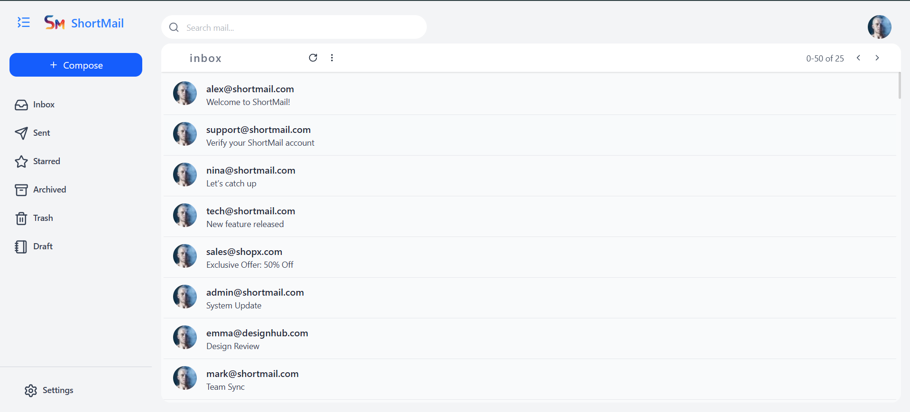

# 📬 ShortMail

**ShortMail** is a simple email system built to simulate a basic mail experience within a single domain — `@shortmail.com`.  
Users can send and receive emails within the same platform, manage their inbox, and update their profiles easily.

---

# 🚀 Features

### ✉️ Mail System

- Send emails to users within the same domain (e.g., `example@shortmail.com`)
- Organize mails by category:
  - 📥 Inbox
  - 📤 Sent
  - ⭐ Starred
  - 🗑️ Trash
  - 🗂️ Archived
  - 📝 Drafts

### 👤 Profile Management

- View and update profile information
- Change name, password, and profile picture

### 📝 Compose Mail

- Create and send new mails
- Supports message-only mode for now

💡 _Upcoming Feature:_  
In the next update, users will be able to attach files and photos while composing emails.

---

## 🛠️ Tech Stack

**Frontend:** React.js, Redux Toolkit, TailwindCSS  
**Backend:** Node.js, Express.js  
**Database:** MongoDB  
**Hosting:** Vercel (Frontend) + Render / Railway (Backend)

---

## ⚙️ Installation & Setup

### Clone the repository

```bash
git clone https://github.com/your-username/shortmail.git
cd shortmail
```

### Backend Setup

```bash
cd server
npm install
npm start
```

### Frontend Setup

```bash
cd client
npm install
npm run dev
```

### Now open your browser at

```
 http://localhost:5173
```

# 📸 Preview



# 🤝 Contributing

### Pull requests are welcome!

For major changes, please open an issue first to discuss what you’d like to change.

# 📄 License

This project is licensed under the MIT [License](askdnskdn).

# 💬 Author

### Mohammad Asif

**_🌐 Connect with Me_**

- 💼 Portfolio: https://mohammadasifhasnain.vercel.app
- 📧 Email: mohammadasif34.dev@gmail.com
- 🐙 GitHub: https://github.com/mohammadasif34
- 💬 LinkedIn: https://linkedin.com/in/mohammadasif34
